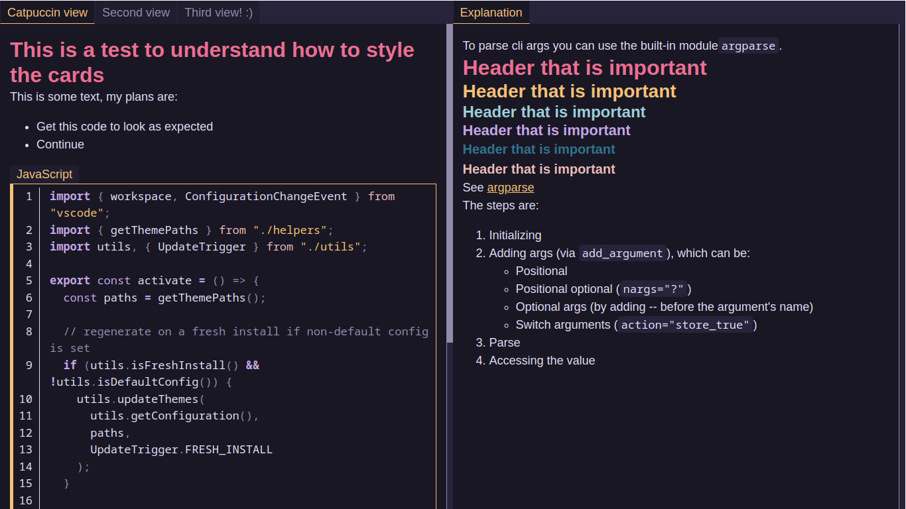

# Markdown2Anki
Markdown2Anki is a python script that bridges Markdown notes and Anki.  
With it, you can easily format your cards using Markdown and import them while retaining the structure you gave them. 
It supports code highlighting, clozes and images.  
There is also support for Obsidian notes, so you can have links inside of your cards pointing to your vault's cards! 🌸

---
 
> Unleash the power of spaced repetition: Convert your Markdown notes into Anki flashcards for optimal learning.  
`ChatGPT, when asked for a captivating description of this project.`

## Objective
To give users a way to format their cards in an easy and flexible way and adding support for some features missing in Anki.  
In particular, the main focus is on:
- Allowing users to navigate the different parts of content quickly
- Create a UI/UX that is intuitive and familiar
- Allow for different themes

[...] TODO: MORE? 

## Why
Anki uses formatted text and html, but makes users pick a very strict way of defining that, while using plain text.
This "helps" some users by shielding them from the possible complexity of formatting the text, but a lot more could be achieved by giving them freedom with Markdown.  

Markdown formatting also makes space for coding cards, which are pretty awful to make in Anki (even if, thanks to [Ijgnd](https://ankiweb.net/shared/info/1100811177) and [Glutanimate](https://ankiweb.net/shared/info/1463041493), there was at least an ok possibility to make them work).  
This means that users do not really need tens of note types, but can define the kind of note they actually need while writing them (or by using their own, flexible templates).  
This also takes away some limitations, such as having to use clozes on only one field of the card.

I (mochitto) also really like the idea of Open Source/Free software communicating between different projects, so creating a "bridge" between Obsidian and Anki feels like a great way of pulling together applications that give society a huge value, making them even stronger.

## DOCS TODO:
- ToC
- Features
  - Support Obsidian
  - What is produced is HTML and your data is independent from the project: cards don't need the script or addons to work
- Installation
  - Git bash on win
- First use
- Labels guide
  - Specifying that tab labels are plain text
- Formatting guide
  - Comments can be written in the top part of cards in the Markdown
- Clozes handling
- Themes and changing theme
- Custom themes
- Contributing/dev docs
- Images processing
  - images copying: no metadata is copyed when copying the images.
- Importing the final file
- Dev specifications
  - Methodology, libraries etc.
  - Frontend is minified
  - SMACSS/BEM for the SASS files/classes
