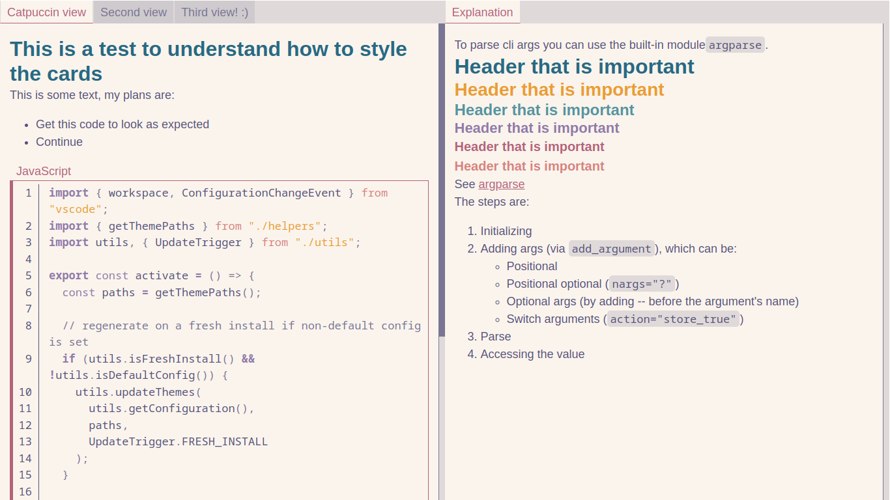
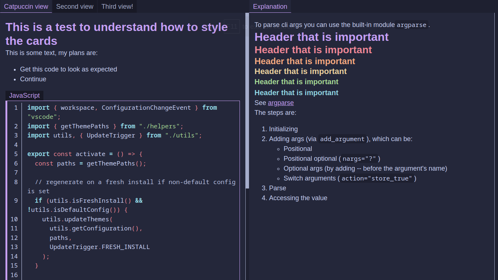

# Markdown2anki themes

## Table of contents
- Dark themes:
    - [Rose Pine](#Rose-Pine)
    - [Catpuccin Macchiato](#Catpuccin-Macchiato)
- Light themes:
    - [Rose Pine Dawn](#Rose-Pine-Dawn)
    - [Catpuccin Latte](#Catpuccin-Latte)

---

## Rose Pine
Inspired by: https://rosepinetheme.com/

## Rose Pine Dawn
Inspired by: https://rosepinetheme.com/

## Catpuccin Macchiato
Inspired by: https://github.com/catppuccin/catppuccin

## Catpuccin Latte
Inspired by: https://github.com/catppuccin/catppuccin

